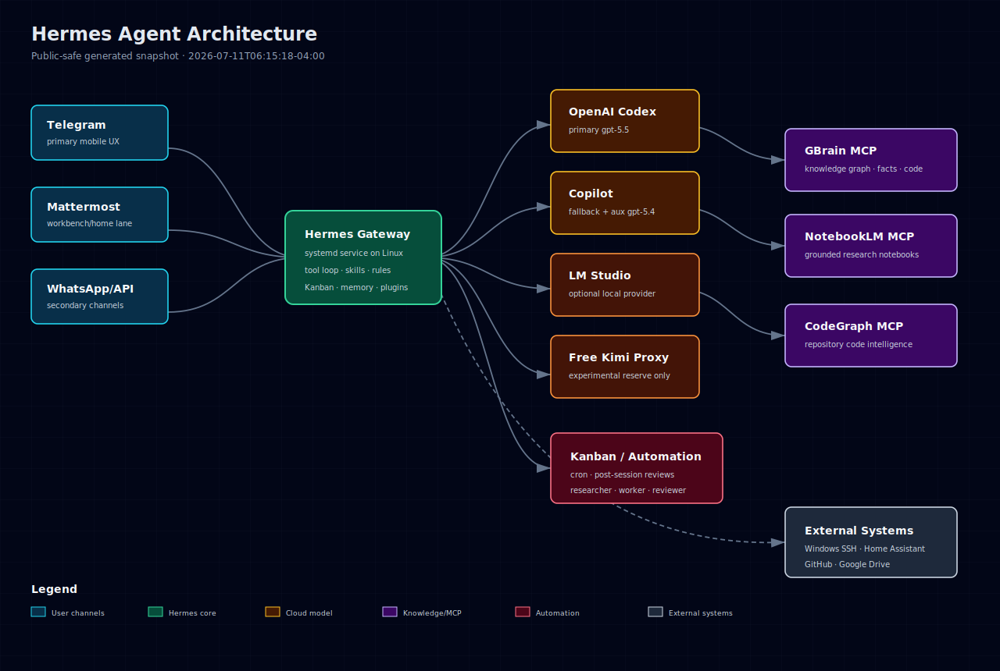

# Hermes Agent Architecture

> Public-safe architecture snapshot generated at `2026-06-22T12:48:36-04:00`.
>
> Source of truth: local Hermes configuration and runtime status on the operator Linux host.
>
> Sensitive values, private chat IDs, OAuth headers, personal finance/client workflow names, and tokens are intentionally omitted or grouped.

## Executive Summary

Hermes Agent runs as a **Linux-primary, multi-platform AI operations hub**. The gateway is a systemd service that connects Telegram, Mattermost, WhatsApp, API Server, Home Assistant, MCP servers, cron jobs, skills, memory/context stores, and remote Windows operations.

The default model remains **`openai-codex / gpt-5.5`**. Local/experimental providers such as **LM Studio** and **Free Kimi** are configured as optional providers only; they are not the default route for Telegram or production workflows.

## High-Level Architecture



## Runtime Topology

| Layer | Components | Notes |
|---|---|---|
| User channels | Telegram, Mattermost, WhatsApp, API Server | Gateway adapters route inbound messages into the same Hermes agent core. |
| Agent core | Hermes Agent gateway + CLI + tool loop | Runs on Linux under `hermes-gateway.service`. |
| Models | OpenAI Codex primary, Copilot fallback, optional LM Studio, optional Free Kimi proxy | Provider selection is explicit; experimental endpoints are not default. |
| Tools | Terminal, files, browser, web, vision, TTS, cron, delegation, Home Assistant, GBrain, NotebookLM, CodeGraph | Enabled toolsets differ by platform/session but the gateway exposes the main operational surface. |
| Knowledge | GBrain, NotebookLM, session search, imported Claude context, skills | Long-term memory and research context are split across structured stores and markdown skills. |
| Automation | Hermes cron scheduler, no-agent scripts, hooks, plugins | Backups, monitoring, GitHub publication, finance snapshots, smart-home logging, news/media digests, and watchdogs. |
| Operational surfaces | Tasks, skills, hooks, plugins, MCP servers, toolsets | Documented as public-safe counts/categories plus selected non-sensitive examples. |
| Remote systems | Windows workstation over SSH, Home Assistant, Google Drive/GitHub, local LM Studio | Linux remains the control plane; Windows is operated remotely when needed. |

## Operational Surface Inventory

| Surface | Detected public-safe state | Notes |
|---|---|---|
| Scheduled tasks / cron | 35 jobs; 25 no-agent script jobs; 0 agent-backed jobs | Exact private task names are grouped by category. |
| Skills | 214 detected skill files across 22 categories | Private/client-sensitive skill names are omitted from examples. |
| Hooks / webhooks | shell allowlist present: False; allowlist entries: 0; plugin hook manifests: 23 | Hook command bodies are not published. |
| Plugins | 63 visible plugin rows captured; enabled estimate 3 | Descriptions omitted to avoid leaking credential/env surfaces. |
| MCP servers | 0 configured MCP servers | GBrain, NotebookLM, CodeGraph are the active core MCP surfaces. |


### Scheduled tasks / cron categories

| Category | Active jobs | Public-safe purpose |
|---|---:|---|
| Backup & sync | 5 | Protect configuration, repositories, databases, and knowledge stores. |
| GitHub & publishing | 6 | Maintain GitHub/publication surfaces and repo health digests. |
| Home automation | 2 | Log smart-home/home-environment telemetry. |
| Knowledge & memory | 4 | Keep GBrain/memory/context stores healthy and up to date. |
| Media/news monitoring | 3 | News, RSS, YouTube, and briefing pipelines. |
| Other scheduled automation | 4 | Other local automation jobs. |
| Private finance automation | 4 | Private finance workflow snapshots; details omitted from public docs. |
| Reliability watchdogs | 7 | Auto-healing, environment guards, timeout/watchdog checks. |


### Skills surface

Hermes currently has a broad skill surface. The public inventory lists category counts and non-sensitive examples only.

| Skill category | Count |
|---|---:|
| .archive | 11 |
| apple | 6 |
| autonomous-ai-agents | 7 |
| creative | 34 |
| data-science | 2 |
| devops | 9 |
| ecc-imports | 4 |
| email | 2 |
| gaming | 2 |
| github | 11 |
| mcp | 1 |
| media | 7 |
| mlops | 19 |
| note-taking | 4 |
| personal | 5 |
| productivity | 20 |
| red-teaming | 1 |
| research | 13 |
| smart-home | 3 |
| social-media | 2 |
| software-development | 33 |
| uncategorized | 18 |


Public-safe skill examples:

| Skill | Category | Public-safe description |
|---|---|---|
| `strategic-reading` | uncategorized | Read a book, article, transcript, or case study through the lens of a specific strategic problem you |
| `article-enrichment` | uncategorized | Transform raw article text dumps in the brain into structured pages with executive summary, verbatim quotes, key insights, why-it-matters, a |
| `skillpack-check` | uncategorized | / |
| `chrome-extensions` | uncategorized | > |
| `modern-web-guidance` | uncategorized | / |
| `concept-synthesis` | uncategorized | Deduplicate and synthesize raw concept stubs into a tiered intellectual map (T1 Canon to T4 Riff), tracing idea evolution across sources ove |
| `ingest` | uncategorized | Route content to specialized ingestion skills. Detects input type and delegates. |
| `yuanbao` | uncategorized | Yuanbao (元宝) groups: @mention users, query info/members. |
| `maintain` | uncategorized | / |
| `academic-verify` | uncategorized | Verify a research claim or academic citation by tracing it through publication → methodology → raw data → independent replication. Routes th |
| `dogfood` | uncategorized | Exploratory QA of web apps: find bugs, evidence, reports. |
| `perplexity-research` | uncategorized | Brain-augmented web research. Sends brain context about a topic to Perplexity, which searches the web with citations and returns what is NEW |
| `retrieval-reflex` | uncategorized | When/what to retrieve — open the brain page for a salient entity before answering from memory. |
| `brain-pdf` | uncategorized | Generate a publication-quality PDF from a GBrain page or markdown file using Hermes-native Chrome rendering. The brain page remains the sour |
| `openhue` | smart-home | Control Philips Hue lights, scenes, rooms via OpenHue CLI. |
| `home-hvac-diagnostics` | smart-home | Diagnose residential HVAC comfort/airflow problems using sensor data, photos, duct/register checks, and safe homeowner tests. |
| `native-mcp` | mcp | MCP client: connect servers, register tools (stdio/HTTP). |
| `xurl` | social-media | X/Twitter via xurl CLI: post, search, DM, media, v2 API. |
| `kanban-codex-lane` | autonomous-ai-agents | Use when a Hermes Kanban worker wants to run Codex CLI as an isolated implementation lane while Hermes keeps ownership of task lifecycle, re |
| `hermes-agent` | autonomous-ai-agents | Configure, extend, or contribute to Hermes Agent. |
| `coding-agent-clis` | autonomous-ai-agents | Use when delegating software work to an external coding-agent CLI such as Claude Code, Codex, or OpenCode, especially for isolated implement |
| `jupyter-live-kernel` | data-science | Iterative Python via live Jupyter kernel (hamelnb). |
| `[REDACTED]` | .archive | Diagnose and advise on residential HVAC comfort imbalance: hot/cold rooms, upstairs/downstairs temperature splits, duct/register airflow, th |
| `[REDACTED]` | .archive | Operate, publish, protect, troubleshoot, and theme the Hermes Web Dashboard. |
| `[REDACTED]` | .archive | Install, update, run, and verify Node/npm-based CLI tools safely; covers npx vs npm install, Node version pitfalls, and global CLI verificat |


### Hooks, webhooks, and plugin hook manifests

Hermes has multiple hook-related surfaces: shell-hook allowlists, webhook subscriptions, and imported Claude/Claude plugin hook manifests. The public repo records only surface/count information, not hook command bodies.

| Hook manifest surface |
|---|
| `.claude/plugins/cache/ponytail/ponytail/4.6.0/hooks/hooks.json` |
| `.claude/plugins/cache/claude-code-warp/warp/2.0.0/hooks/hooks.json` |
| `.claude/plugins/cache/thedotmack/claude-mem/13.4.1/hooks/hooks.json` |
| `.claude/plugins/cache/thedotmack/claude-mem/13.3.0/hooks/hooks.json` |
| `.claude/plugins/cache/thedotmack/claude-mem/13.4.0/hooks/hooks.json` |
| `.claude/plugins/cache/thedotmack/claude-mem/13.0.0/hooks/hooks.json` |
| `.claude/plugins/cache/thedotmack/claude-mem/13.0.1/hooks/hooks.json` |
| `.claude/plugins/cache/thedotmack/claude-mem/13.1.0/hooks/hooks.json` |
| `.claude/plugins/cache/thedotmack/claude-mem/13.2.0/hooks/hooks.json` |
| `.claude/plugins/marketplaces/ponytail/hooks/hooks.json` |
| `[REDACTED]` |
| `.claude/plugins/marketplaces/claude-code-plugins/plugins/ralph-wiggum/hooks/hooks.json` |
| `.claude/plugins/marketplaces/claude-code-plugins/plugins/hookify/hooks/hooks.json` |
| `.claude/plugins/marketplaces/claude-code-plugins/plugins/security-guidance/hooks/hooks.json` |
| `.claude/plugins/marketplaces/claude-code-plugins/plugins/learning-output-style/hooks/hooks.json` |
| `.claude/plugins/marketplaces/claude-code-warp/plugins/warp/hooks/hooks.json` |
| `[REDACTED]` |
| `.claude/plugins/marketplaces/claude-plugins-official/plugins/ralph-loop/hooks/hooks.json` |
| `.claude/plugins/marketplaces/claude-plugins-official/plugins/hookify/hooks/hooks.json` |
| `.claude/plugins/marketplaces/claude-plugins-official/plugins/security-guidance/hooks/hooks.json` |


### Plugin surface

| Plugin | Status |
|---|---|
| `browser-browser-use` | not enabled |
| `browser-browserbase` | not enabled |
| `browser-firecrawl` | not enabled |
| `chronos` | not enabled |
| `basic` | not enabled |
| `nous` | not enabled |
| `self-hosted` | not enabled |
| `disk-cleanup` | not enabled |
| `google_meet` | not enabled |
| `fal` | not enabled |
| `krea` | not enabled |
| `openai` | not enabled |
| `openai-codex` | not enabled |
| `xai` | not enabled |
| `alibaba-provider` | not enabled |
| `anthropic-provider` | not enabled |
| `arcee-provider` | not enabled |
| `bedrock-provider` | not enabled |
| `copilot-provider` | not enabled |
| `copilot-acp-provider` | not enabled |
| `custom-provider` | not enabled |
| `deepseek-provider` | not enabled |
| `gemini-provider` | not enabled |
| `gmi-provider` | not enabled |
| `huggingface-provider` | not enabled |
| `kilocode-provider` | not enabled |
| `kimi-coding-provider` | not enabled |
| `minimax-provider` | not enabled |
| `nous-provider` | not enabled |
| `novita-provider` | not enabled |


## Low-Level Surface Files

The repository includes dedicated, low-level public-safe files for each operational surface:

| File | Contents |
|---|---|
| [`docs/surfaces/tasks.md`](docs/surfaces/tasks.md) | Scheduled tasks/cron jobs, modes, scripts, schedules, delivery class, workdir class. |
| [`docs/surfaces/skills.md`](docs/surfaces/skills.md) | Skill categories, counts, public-safe examples, operational semantics. |
| [`docs/surfaces/hooks.md`](docs/surfaces/hooks.md) | Shell hook allowlist state, webhook state, plugin hook manifests. |
| [`docs/surfaces/plugins.md`](docs/surfaces/plugins.md) | Hermes plugin registry rows and status. |
| [`docs/surfaces/mcp-and-toolsets.md`](docs/surfaces/mcp-and-toolsets.md) | MCP servers and toolset count estimates. |
| [`docs/surfaces/models-and-gateway.md`](docs/surfaces/models-and-gateway.md) | Model routing, gateway status, channel/platform surface. |

## Model Routing

| Role | Provider | Model | Notes |
|---|---|---|---|
| Primary |  |  | Default for Telegram/API/CLI gateway sessions |
| Fallback |  |  | Used when primary fails |


### Local model trial status

| Item | Status |
|---|---|
| LM Studio endpoint | `available` at `http://127.0.0.1:1234/v1` |
| Reported model IDs | `mythosnanoq6, qwythos9bq5, gemma4coderq3, gemma4coderq4, oymuncq4, [REDACTED], gemma4unc, [REDACTED]` |
| Chat smoke test | `blocked_or_unavailable: {
"error": {
    "message": "Failed to load model \"gemma4unc\". Error: Model loading was stopped due to insufficient system resources. Under the current settings, this model requires approximately 14.36 GB of memory, and continuing` |
| Safety decision | Main Hermes remains `openai-codex/gpt-5.5`; local provider is optional until a model can load reliably. |

## MCP and External Tooling

| MCP server | Transport | Public-safe purpose |
|---|---|---|
| `gbrain` | Local HTTP MCP on `127.0.0.1:3131/mcp` | Personal knowledge graph, memory, code graph, facts, schema tools. |
| `notebooklm` | `npx notebooklm-mcp@latest` | Grounded research over registered Google NotebookLM notebooks. |
| `codegraph` | Local Node command | Code intelligence over selected repositories. |

## Scheduled Automation

| Category | Active jobs | Public-safe purpose |
|---|---:|---|
| Backup & sync | 5 | Protect configuration, repositories, databases, and knowledge stores. |
| GitHub & publishing | 6 | Maintain GitHub/publication surfaces and repo health digests. |
| Home automation | 2 | Log smart-home/home-environment telemetry. |
| Knowledge & memory | 4 | Keep GBrain/memory/context stores healthy and up to date. |
| Media/news monitoring | 3 | News, RSS, YouTube, and briefing pipelines. |
| Other scheduled automation | 4 | Other local automation jobs. |
| Private finance automation | 4 | Private finance workflow snapshots; details omitted from public docs. |
| Reliability watchdogs | 7 | Auto-healing, environment guards, timeout/watchdog checks. |


## Current Profiles

The live system currently exposes the default profile publicly as:

```text
Profile          Model                        Gateway      Alias        Distribution
 ───────────────    ───────────────────────────    ───────────    ───────────    ────────────────────
 ◆default         gpt-5.5                      running      —            —
```

Future recommended profile split:

| Profile | Purpose | Model stance |
|---|---|---|
| `default` | Main Telegram/personal assistant | `openai-codex/gpt-5.5` primary, Copilot fallback. |
| `local-lmstudio` | Experimental local-model testing | LM Studio only after a local model can pass smoke tests. |
| `dev` | Developer workflows with larger context and coding tools | Can selectively use cloud or local providers. |
| `voice-coach` | Low-latency full-duplex voice experiments | Minimal tools/skills, local STT/TTS first. |

## Reliability and Safety Boundaries

- Public repo does **not** publish secrets, chat IDs, API keys, OAuth tokens, cookies, private finance details, or client-specific payloads.
- The gateway is supervised by systemd and multiple watchdog cron jobs.
- GBrain runs through a shared local HTTP MCP server to avoid PGLite lock contention.
- Backups and sync jobs run through cron with Google Drive/GitHub targets.
- Windows is treated as a remote worker controlled via SSH, not as the primary Hermes control plane.
- Experimental providers are explicitly optional and must pass direct API + Hermes smoke tests before being used for real agent work.

## Operational Notes

- Hermes version/status summary:

```text
Hermes Agent v0.17.0 (2026.6.19) · upstream b1b20270 · local f7524d0d (+2 carried commits)
Project: ~/.hermes/hermes-agent
Python: 3.11.15
OpenAI SDK: 2.24.0
Update available: 373 commits behind — run 'hermes update'
```

- Fallback chain:

```text
Primary:   gpt-5.5  (via openai-codex)

  Fallback chain (1 entry):
1. gpt-5.4  (via copilot)

  Tried in order when the primary fails (rate-limit, 5xx, connection errors).
  Docs: https://hermes-agent.nousresearch.com/docs/user-guide/features/fallback-providers
```

- MCP list:

```text
MCP Servers:

  Name             Transport                      Tools        Status    
  ──────────────── ────────────────────────────── ──────────── ──────────
  codegraph        ~/.nvm/versions/no...   all          ✓ enabled
  gbrain           http://127.0.0.1:3131/mcp      all          ✓ enabled
  notebooklm       npx -y notebooklm-mcp@latest   all          ✓ enabled
  homeway          https://homeway.io/api/mcp     all          ✓ enabled
```

## Maintenance

This repository is regenerated by `scripts/update_architecture.py`. The updater is designed to be safe for a public repository:

1. collect local Hermes runtime state,
2. redact secrets and private identifiers,
3. group sensitive scheduled jobs by category,
4. regenerate Markdown, SVG, HTML, JSON inventory, and PDF,
5. commit and push only if files changed.

## Source Files

- `ARCHITECTURE.md` - canonical public architecture document.
- `docs/hermes-architecture.svg` - standalone diagram.
- `docs/hermes-architecture.html` - browser-friendly diagram page.
- `docs/Hermes-Architecture.pdf` - rendered PDF copy.
- `docs/surfaces/*.md` - low-level public-safe inventories for tasks, skills, hooks, plugins, MCP/toolsets, and gateway/model routing.
- `data/inventory.public.json` - redacted machine-readable snapshot.
- `scripts/update_architecture.py` - public-safe regeneration script.
