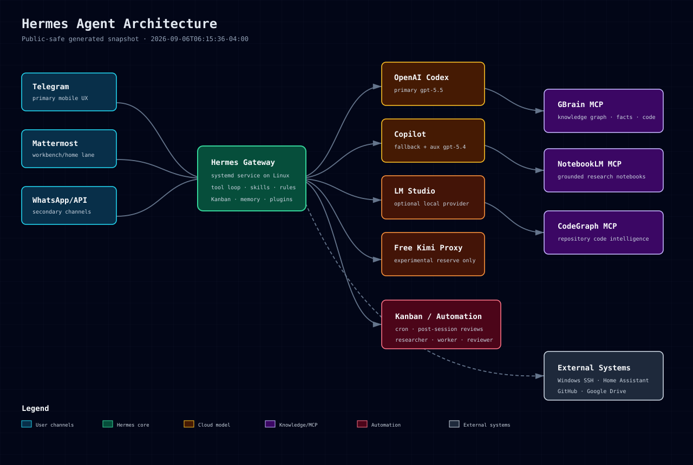

# Hermes Agent Architecture

> Public-safe architecture snapshot generated at `2026-09-04T06:15:54-04:00`.
>
> Source of truth: local Hermes configuration and runtime status on the operator Linux host.
>
> Sensitive values, private chat IDs, OAuth headers, personal finance/client workflow names, and tokens are intentionally omitted or grouped.

## Executive Summary

Hermes Agent runs as a **Linux-primary, multi-platform AI operations hub**. The gateway is a systemd service that connects Telegram, Mattermost, WhatsApp, API Server, Home Assistant, MCP servers, cron jobs, skills, memory/context stores, and remote Windows operations.

The current architecture adds a **durable Kanban orchestration layer**: `default` remains the interactive/orchestrator profile, while `researcher`, `worker`, and `reviewer` are launched as ephemeral Kanban worker-runs for durable research, implementation, and verification tasks. Safe post-session automation generates local review artifacts (session summaries, skill-mining candidates, trace-derived code graphs) without silently installing skills or uploading traces.

The default model remains **`openai-codex / gpt-5.5`**. Local/experimental providers such as **LM Studio** and **Free Kimi** are configured as optional providers only; they are not the default route for Telegram or production workflows.

## High-Level Architecture



## Runtime Topology

| Layer | Components | Notes |
|---|---|---|
| User channels | Telegram, Mattermost, WhatsApp, API Server | Gateway adapters route inbound messages into the same Hermes agent core. |
| Agent core | Hermes Agent gateway + CLI + tool loop | Runs on Linux under `hermes-gateway.service`. |
| Models | OpenAI Codex primary, Copilot fallback, optional LM Studio, optional Free Kimi proxy | Provider selection is explicit; experimental endpoints are not default. |
| Tools | Terminal, files, browser, web, vision, TTS, cron, delegation, Home Assistant, GBrain, NotebookLM, CodeGraph | Enabled toolsets differ by platform/session but the gateway exposes the main operational surface. |
| Knowledge | GBrain, NotebookLM, session search, imported Claude context, skills | Long-term memory and research context are split across structured stores and markdown skills. |
| Automation | Hermes cron scheduler, no-agent scripts, hooks, plugins, post-session automation | Backups, monitoring, GitHub publication, finance snapshots, smart-home logging, news/media digests, watchdogs, session summaries, skill-mining reviews, and trace graphs. |
| Durable orchestration | Kanban dispatcher + `default`/`researcher`/`worker`/`reviewer` profiles | The gateway dispatcher claims ready tasks and launches profile-specific worker-runs; `stopped` profiles are normal idle state. |
| Operational surfaces | Tasks, skills, rules, hooks, plugins, MCP servers, toolsets | Documented as public-safe counts/categories plus selected non-sensitive examples. |
| Remote systems | Windows workstation over SSH, Home Assistant, Google Drive/GitHub, local LM Studio | Linux remains the control plane; Windows is operated remotely when needed. |

## Operational Surface Inventory

| Surface | Detected public-safe state | Notes |
|---|---|---|
| Scheduled tasks / cron | 77 jobs; 39 no-agent script jobs; 0 agent-backed jobs | Exact private task names are grouped by category. |
| Skills | 391 detected skill files across 28 categories | Private/client-sensitive skill names are omitted from examples. |
| Hooks / webhooks | shell allowlist present: False; allowlist entries: 0; plugin hook manifests: 0 | Hook command bodies are not published. |
| Plugins | 53 visible plugin rows captured; enabled estimate 22 | Descriptions omitted to avoid leaking credential/env surfaces. |
| MCP servers | 11 configured MCP servers | GBrain, NotebookLM, CodeGraph are the active core MCP surfaces. |


### Scheduled tasks / cron categories

| Category | Active jobs | Public-safe purpose |
|---|---:|---|
| Backup & sync | 5 | Protect configuration, repositories, databases, and knowledge stores. |
| GitHub & publishing | 6 | Maintain GitHub/publication surfaces and repo health digests. |
| Home automation | 2 | Log smart-home/home-environment telemetry. |
| Knowledge & memory | 7 | Keep GBrain/memory/context stores healthy and up to date. |
| Media/news monitoring | 2 | News, RSS, YouTube, and briefing pipelines. |
| Other scheduled automation | 38 | Other local automation jobs. |
| Private finance automation | 5 | Private finance workflow snapshots; details omitted from public docs. |
| Reliability watchdogs | 12 | Auto-healing, environment guards, timeout/watchdog checks. |


### Skills surface

Hermes currently has a broad skill surface. The public inventory lists category counts and non-sensitive examples only.

| Skill category | Count |
|---|---:|
| .archive | 12 |
| android | 2 |
| apple | 9 |
| autonomous-ai-agents | 22 |
| creative | 35 |
| data-science | 1 |
| devops | 28 |
| ecc-imports | 4 |
| email | 5 |
| external | 7 |
| gaming | 2 |
| github | 9 |
| mcp | 2 |
| media | 8 |
| mlops | 18 |
| note-taking | 4 |
| operations | 3 |
| personal | 9 |
| productivity | 45 |
| red-teaming | 1 |
| research | 33 |
| security | 4 |
| smart-home | 4 |
| social-media | 2 |
| software-development | 100 |
| uncategorized | 19 |
| web | 2 |
| web-development | 1 |


Public-safe skill examples:

| Skill | Category | Public-safe description |
|---|---|---|
| `obsidian` | note-taking | Read, search, create, and edit notes in the Obsidian vault. |
| `comfyui` | creative | Generate images, video, and audio with ComfyUI — install, launch, manage nodes/models, run workflows with parameter injection. Uses the offi |
| `[REDACTED]` | creative | Article illustrations: type × style × palette consistency. |
| `humanizer` | creative | Humanize text: strip AI-isms and add real voice. |
| `pixel-art` | creative | Pixel art w/ era palettes (NES, Game Boy, PICO-8). |
| `ascii-video` | creative | ASCII video: convert video/audio to colored ASCII MP4/GIF. |
| `manim-video` | creative | Manim CE animations: 3Blue1Brown math/algo videos. |
| `architecture-diagram` | creative | Dark-themed SVG architecture/cloud/infra diagrams as HTML. |
| `ascii-media` | creative | Create ASCII still art, banners, image conversions, and animated ASCII video/audio visuals from one umbrella workflow. |
| `claude-design` | creative | Design one-off HTML artifacts (landing, deck, prototype). |
| `pretext` | creative | Build creative browser demos with DOM-free text layout. |
| `hyperframes` | creative | Render MP4/WebM videos from HTML compositions. |
| `apple-design` | creative | Design or review Apple-inspired web interactions with direct manipulation, interruptible spring motion, velocity handoff, momentum, rubber-b |
| `[REDACTED]` | creative | Songwriting craft and Suno AI music prompts. |
| `p5js` | creative | p5.js sketches: gen art, shaders, interactive, 3D. |
| `reference-safe-design` | creative | Use when a user supplies websites, screenshots, brand campaigns, moodboards, copy, motion, or assets and wants either an originality audit o |
| `baoyu-comic` | creative | Knowledge comics (知识漫画): educational, biography, tutorial. |
| `touchdesigner-mcp` | creative | Control TouchDesigner via twozero MCP. |
| `creative-ideation` | creative | Generate ideas via named methods from creative practice. |
| `design-md` | creative | Author/validate/export Google |
| `excalidraw` | creative | Hand-drawn Excalidraw JSON diagrams (arch, flow, seq). |
| `popular-web-designs` | creative | 54 real design systems (Stripe, Linear, Vercel) as HTML/CSS. |
| `concept-diagrams` | creative | Generate flat, minimal educational SVG visuals as HTML. |
| `blender-mcp` | creative | Control Blender directly from Hermes via socket connection to the blender-mcp addon. Create 3D objects, materials, animations, and run arbit |
| `baoyu-infographic` | creative | Infographics: 21 layouts x 21 styles (信息图, 可视化). |


### Hooks, webhooks, and plugin hook manifests

Hermes has multiple hook-related surfaces: shell-hook allowlists, webhook subscriptions, and imported Claude/Claude plugin hook manifests. The public repo records only surface/count information, not hook command bodies.

| Hook manifest surface |
|---|
| none detected |


### Plugin surface

| Plugin | Status |
|---|---|
| `browser-firecrawl` | enabled |
| `chronos` | not enabled |
| `basic` | not enabled |
| `drain` | not enabled |
| `nous` | not enabled |
| `self-hosted` | enabled |
| `disk-cleanup` | enabled |
| `google_meet` | not enabled |
| `deepinfra` | enabled |
| `fal` | not enabled |
| `krea` | not enabled |
| `meta-ai-image-gen` | not enabled |
| `openai` | enabled |
| `openai-codex` | enabled |
| `openrouter` | enabled |
| `xai` | not enabled |
| `langfuse` | not enabled |
| `a2a-platform` | not enabled |
| `buzz-platform` | not enabled |
| `dingtalk-platform` | not enabled |
| `discord-platform` | not enabled |
| `email-platform` | not enabled |
| `feishu-platform` | not enabled |
| `irc-platform` | not enabled |
| `line-platform` | not enabled |
| `matrix-platform` | not enabled |
| `ntfy-platform` | not enabled |
| `photon-platform` | not enabled |
| `raft-platform` | not enabled |
| `simplex-platform` | not enabled |


## Low-Level Surface Files

The repository includes dedicated, low-level public-safe files for each operational surface:

| File | Contents |
|---|---|
| [`docs/surfaces/tasks.md`](docs/surfaces/tasks.md) | Scheduled tasks/cron jobs, modes, scripts, schedules, delivery class, workdir class. |
| [`docs/surfaces/skills.md`](docs/surfaces/skills.md) | Skill categories, counts, public-safe examples, operational semantics. |
| [`docs/surfaces/hooks.md`](docs/surfaces/hooks.md) | Shell hook allowlist state, webhook state, plugin hook manifests. |
| [`docs/surfaces/plugins.md`](docs/surfaces/plugins.md) | Hermes plugin registry rows and status. |
| [`docs/surfaces/mcp-and-toolsets.md`](docs/surfaces/mcp-and-toolsets.md) | MCP servers and toolset count estimates. |
| [`docs/surfaces/models-and-gateway.md`](docs/surfaces/models-and-gateway.md) | Model routing, gateway status, channel/platform surface. |
| [`docs/surfaces/orchestration.md`](docs/surfaces/orchestration.md) | Kanban profiles, rules layer, self-improvement automation, and operating contract. |

## Model Routing

| Role | Provider | Model | Notes |
|---|---|---|---|
| Primary | openai-codex | gpt-5.6-terra | Default for Telegram/API/CLI gateway sessions |
| Fallback |  |  | Used when primary fails |
| Optional provider | lmstudio | qwenvl3bunc | http://127.0.0.1:1234/v1 |
| Optional provider | nvidia | meta/llama-3.3-70b-instruct | https://integrate.api.nvidia.com/v1 |
| Optional provider | freekimi | cfbt-kimi | http://127.0.0.1:3271/v1 |
| Optional provider | forge_freekimi | cfbt-kimi | http://127.0.0.1:8081/v1 |
| Optional provider | forge_lmstudio | qwenvl3bunc | http://127.0.0.1:8082/v1 |
| Optional provider | chatgpt_web | chatgpt-5.6-sol-high-web | https://codex.guber.dev/v1 |
| Optional provider | codex_web_gpt | chatgpt-web/light | http://100.82.137.49:17842/v1 |


### Local model trial status

| Item | Status |
|---|---|
| LM Studio endpoint | `not reachable` at `http://127.0.0.1:1234/v1` |
| Reported model IDs | `none` |
| Chat smoke test | `blocked_or_unavailable: <urlopen error [Errno 111] Connection refused>` |
| Safety decision | Main Hermes remains `openai-codex/gpt-5.5`; local provider is optional until a model can load reliably. |

## MCP and External Tooling

| MCP server | Transport | Public-safe purpose |
|---|---|---|
| `gbrain` | Local HTTP MCP on `127.0.0.1:3131/mcp` | Personal knowledge graph, memory, code graph, facts, schema tools. |
| `notebooklm` | `npx notebooklm-mcp@latest` | Grounded research over registered Google NotebookLM notebooks. |
| `codegraph` | Local Node command | Code intelligence over selected repositories. |

## Scheduled Automation

| Category | Active jobs | Public-safe purpose |
|---|---:|---|
| Backup & sync | 5 | Protect configuration, repositories, databases, and knowledge stores. |
| GitHub & publishing | 6 | Maintain GitHub/publication surfaces and repo health digests. |
| Home automation | 2 | Log smart-home/home-environment telemetry. |
| Knowledge & memory | 7 | Keep GBrain/memory/context stores healthy and up to date. |
| Media/news monitoring | 2 | News, RSS, YouTube, and briefing pipelines. |
| Other scheduled automation | 38 | Other local automation jobs. |
| Private finance automation | 5 | Private finance workflow snapshots; details omitted from public docs. |
| Reliability watchdogs | 12 | Auto-healing, environment guards, timeout/watchdog checks. |


## Agentic Operating Model

| Item | Value | Meaning |
|---|---|---|
| Interactive orchestrator | `default` | Main Telegram/API/CLI profile; decides whether to answer directly, delegate, create Kanban work, or schedule cron. |
| Research lane | `researcher` | Evidence-backed OSS/docs/web due diligence and adoption recommendations. |
| Execution lane | `worker` | File/terminal/code/config implementation and verification for durable work items. |
| Review lane | `reviewer` | Independent review, regression checks, security/config sanity, and final validation. |
| Default assignee | `worker` | Fallback when a task/decomposer does not choose a specialist. |
| Failure limit | `5` | Raised above the previous aggressive default to avoid noisy retry failures. |
| Per-profile concurrency | `1` | Keeps one profile from saturating model/API/browser capacity. |
| Post-session automation | `enabled` | Generates review artifacts only; does not auto-install remote skills or mutate active prompts. |


The important runtime distinction is that `researcher`, `worker`, and `reviewer` do **not** need to be continuously running gateway profiles. They are idle until a Kanban task is assigned to them; then the gateway dispatcher starts a worker-run for that profile and the worker completes, blocks, or retries the task.

## Current Profiles

The live system currently exposes the public-safe profile roster as:

```text
Profile          Model                        Gateway      Alias        Distribution
 ───────────────    ───────────────────────────    ───────────    ───────────    ────────────────────
 ◆default         gpt-5.6-terra                running      —            —
  claude          —                            running      —            —
  coding          gpt-5.6-sol                  running      coding       —
  ghidra-restricted gpt-5.6-sol                  running      —            —
  researcher      gpt-5.6-terra                running      hermes-researcher —
  reviewer        gpt-5.6-sol                  running      hermes-reviewer —
  security-restricted gpt-5.6-sol                  running      hermes-security —
  worker          gpt-5.6-terra                running      hermes-worker —
```

Current profile contract:

| Profile | Role | Runtime behavior |
|---|---|---|
| `default` | Interactive orchestrator | Stays running in Telegram/API/CLI gateway; routes work. |
| `researcher` | Research/due-diligence worker | Normally stopped; launched by Kanban for evidence gathering. |
| `worker` | Implementation/execution worker | Normally stopped; fallback assignee for durable tasks. |
| `reviewer` | Independent verification worker | Normally stopped; launched for review/regression/security checks. |

## Reliability and Safety Boundaries

- Public repo does **not** publish secrets, chat IDs, API keys, OAuth tokens, cookies, private finance details, or client-specific payloads.
- The gateway is supervised by systemd and multiple watchdog cron jobs.
- GBrain runs through a shared local HTTP MCP server to avoid PGLite lock contention.
- Backups and sync jobs run through cron with Google Drive/GitHub targets.
- Windows is treated as a remote worker controlled via SSH, not as the primary Hermes control plane.
- Experimental providers are explicitly optional and must pass direct API + Hermes smoke tests before being used for real agent work.

## Operational Notes

- Hermes version/status summary:

```text
Hermes Agent v0.21.0 (2026.8.31) · upstream 63279301
Install directory: ~/.hermes/hermes-agent
Install method: git
Python: 3.11.16
OpenAI SDK: 2.24.0
Up to date
```

- Fallback chain:

```text
Primary:   gpt-5.6-terra  (via openai-codex)

  Fallback chain (4 entries):
1. ox-alpha-free  (via opencode-go)
2. stealth/ox-alpha  (via nous)
3. chatgpt-web/high  (via codex-web-gpt)
4. gpt-5.3-codex-spark  (via openai-codex)

  Tried in order when the primary fails (rate-limit, 5xx, connection errors).
  Docs: https://hermes-agent.nousresearch.com/docs/user-guide/features/fallback-providers
```

- MCP list:

```text
MCP Servers:

  Name             Transport                      Tools        Status    
  ──────────────── ────────────────────────────── ──────────── ──────────
  keep-mcp         ~/.hermes/scripts/...   16 selected  ✓ enabled
  codegraph        ~/.nvm/versions/no...   all          ✓ enabled
  gbrain           http://127.0.0.1:3131/mcp      all          ✓ enabled
  notebooklm       npx -y notebooklm-mcp@latest   all          ✓ enabled
  windows-cua      ~/.local/bin/windo...   all          ✓ enabled
  monarch          https://api.monarch.com/mcp    17 selected  ✓ enabled
  cloudflare-api   https://mcp.cloudflare.co...   all          ✓ enabled
  pixelrag         ~/github/pixelrag-...   all          ✓ enabled
  vibe_trading     ~/.hermes/scripts/...   29 selected  ✓ enabled
  display          https://api.display.dev/v...   all          ✓ enabled
  open_notebook    ~/.hermes/oss-eval...   all          ✓ enabled
```

## Maintenance

This repository is regenerated by `scripts/update_architecture.py`. The updater is designed to be safe for a public repository:

1. collect local Hermes runtime state,
2. redact secrets and private identifiers,
3. group sensitive scheduled jobs by category,
4. regenerate Markdown, SVG, HTML, JSON inventory, and PDF,
5. commit and push only if files changed.

## Source Files

- `ARCHITECTURE.md` - canonical public architecture document.
- `docs/hermes-architecture.svg` - standalone diagram.
- `docs/hermes-architecture.html` - browser-friendly diagram page.
- `docs/Hermes-Architecture.pdf` - rendered PDF copy.
- `docs/surfaces/*.md` - low-level public-safe inventories for tasks, skills, hooks, plugins, MCP/toolsets, and gateway/model routing.
- `data/inventory.public.json` - redacted machine-readable snapshot.
- `scripts/update_architecture.py` - public-safe regeneration script.
